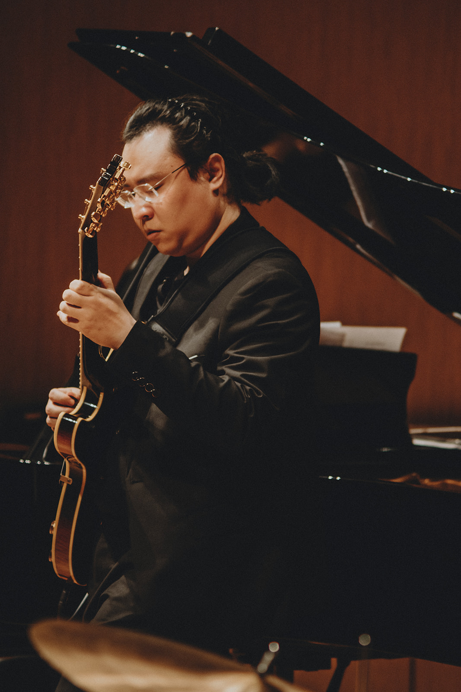

# 👋 Hi, I’m Runsheng Zhao
**Jazz guitarist · educator · digital garden**

  <!-- Left Text -->
  

  
Runsheng Zhao is a jazz guitarist and educator based in Denton, Texas. He is currently pursuing a Master of Music in Jazz Studies at the University of North Texas, where he also serves as a Teaching Fellow for the Super 400 guitar ensemble.

He has performed with the UNT Latin Jazz Lab Band and various small combos, appearing at the Denton Arts & Jazz Festival as well as local venues such as Steve’s Winehouse and Harvest House.

Runsheng’s pedagogical interests focus on cognitive science and music education philosophy. He believes a praxial approach to music aligns closely with the jazz tradition he loves.

For English-speaking visitors: While most of the content is written in Chinese, I hope you’ll still find something useful or inspiring here.

***Feel free to reach out:***   <a href="mailto:rz@runshengzhao.com" class="email-btn">✉️ Email me</a>

  

  <!-- Right Image -->
  

    
  

  

# 👋你好，我是赵润生

感谢你来到我的个人网站/数字花园。你可以通过旁边的***导航***🧭去不同的地方看看。

[[About Me/index|About Me 关于我]]： 个人网站的必备元素都在这里啦，Biography，一些照片和演出视频，还有联系方式。

[[Wiki/Guitarology/index|Guitarology吉他学🎸]] ： 我在这里分享关于吉他的一系列话题，如果你想了解我是怎么理解吉他的，去那里看看吧。

[[Wiki/Live Review/index|Live Review 现场评论🎵]]：有我记录的一些对现场演出的思考。如果你也喜欢看演出，没准对你有所启发。

[[Wiki/Music Theory and Beyond/index|Music Theory and Beyond 乐理和其他🎵]] ：一些超过吉他范畴的乐理思考。

**请联系我**:   <a href="mailto:rz@runshengzhao.com" class="email-btn">✉️ 发送邮件</a>

---

Thanks for stopping by.  
— Runsheng

---
<form
  action="https://buttondown.com/api/emails/embed-subscribe/RunshengZhao"
  method="post"
  target="popupwindow"
  onsubmit="window.open('https://buttondown.com/RunshengZhao', 'popupwindow')"
  class="embeddable-buttondown-form"
  style="max-width: 600px; font-family: sans-serif; margin: 0 auto; text-align: center;"
>
  

    Subscribe 订阅我的数字花园！ 
    (I won't spam you — you'll be lucky if I get my lazy ass up to write something.)
  

  <input
    type="email"
    name="email"
    id="bd-email"
    placeholder="Your email here..."
    required
    style="width: 80%; padding: 0.5em; font-size: 1em; margin-bottom: 0.25em; text-align: center;"
  /> 

  <input
    type="submit"
    value="Subscribe|订阅!"
    style="padding: 0.5em 1em; font-size: 1em; background-color: #333; color: white; border: none; border-radius: 4px; cursor: pointer;"
  />
</form>

